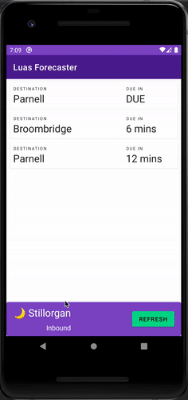

# Luas Forecaster

Simple Android app which shows when next Luas is due at predefined locations, depending on time of day, as tool for commuters.

## Shows information for

1. If before midday, shows next trams arriving at Marlborough Luas stop, with _Outbound_ direction.
2. If after midday (12:01pm and later), shows next trams arriving at Stillorgan Luas stop, with _Inbound_ direction.

Shows which station currently showing information for.

Has refresh button which will fetch latest information.

Luas colour scheme used, as sampled on [luas.ie](https://luas.ie), combining Luas purple with Transport for Ireland (TFI) green.

## Notes on code

While simple, the app uses good practice, clean design and standards (except importantly lacking DI!)

1. Written in Kotlin language
2. MVVM architecture pattern used, separating back end (network access) into separate `api` module, used by `ViewModel`s, which update presentation layer via `LiveData` and accept actions as method calls
3. Data binding used to inflate layouts and pragmatically interact with layout `View`s. Where possible connect `ViewModel` directly into declarative XML
4. Koltin Coroutines used with RetroFit2 to fetch network API data, with [TikXml](https://github.com/Tickaroo/tikxml) library to parse XML
5. Material Design Components (MDC) used, gives simple familiar Android standard UI look and feel
6. Dark mode support (automatically by MDC, but with additional tweaks)
7. Best practice string and dimension management used, ready for localisation and various custom screen size supports if required

Note also that `SingleLiveEvent` class is transplanted in (as Java code, with some modifications) from Google examples. This is a really useful class for one time message delivery from `ViewModel` to `Fragment` using `LiveData` pattern.

## Future work

The app is currently very simple and lacks several features user will likely expect.

Future **feature** work could include:

1. Allow user to set stations! Currently hardcoded
2. Automatic polling of Luas forecast information
3. Local information cache, in case of temporary internet disconnection, and showing last available information

Future **technical** work:

1. Use dependency injection (DI) instead of ad hoc _singleton_ objects, for RetroFit2 and TikXml 3rd party lib instances, and internal `PublicInfoDisplaySource` object.
2. Use repository pattern with caching, instead of direct data source usage in `ViewModel`
3. Add unit and instrumentation tests! Code is prepared for this but not yet implemented.